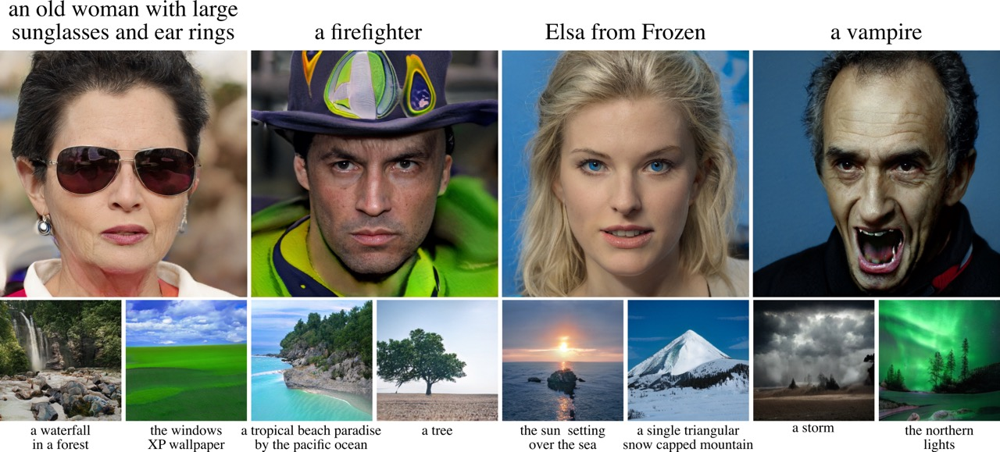

# clip2latent - Official PyTorch Code

[](https://arxiv.org/abs/2210.02347)
[](https://colab.research.google.com/github/justinpinkney/clip2latent/blob/main/demo.ipynb)
[](https://huggingface.co/spaces/lambdalabs/clip2latent-demo)



> ## _clip2latent: Text driven sampling of a pre-trained StyleGAN using denoising diffusion and CLIP_
>
> Justin N. M. Pinkney and Chuan Li
> @ Lambda Inc.
>
> We introduce a new method to efficiently create text-to-image models from a pre-trained CLIP and StyleGAN. It enables text driven sampling with an existing generative model without any external data or fine-tuning. This is achieved by training a diffusion model conditioned on CLIP embeddings to sample latent vectors of a pre-trained StyleGAN, which we call \textit{clip2latent}. We leverage the alignment between CLIP’s image and text embeddings to avoid the need for any text labelled data for training the conditional diffusion model. We demonstrate that clip2latent allows us to generate high-resolution (1024x1024 pixels) images based on text prompts with fast sampling, high image quality, and low training compute and data requirements. We also show that the use of the well studied StyleGAN architecture, without further fine-tuning, allows us to directly apply existing methods to control and modify the generated images adding a further layer of control to our text-to-image pipeline.


## Installation

```bash
git clone https://github.com/justinpinkney/clip2latent.git
cd clip2latent
python -m venv .venv --prompt clip2latent
. .venv/bin/activate
pip install --upgrade pip
pip install -r requirements.txt
```

## Usage

### Inference

To run the models for inference the simplest way is to start the gradio demo (or run it [in Colab](https://colab.research.google.com/github/justinpinkney/clip2latent/blob/demo/colab-gradio.ipynb)):

```bash
python scripts/demo.py
```

This will fetch the required models from huggingface hub and start gradio demo which can be accessed via a web browser.

To run a model via python:

```python
from clip2latent import models

prompt = "a hairy man"
device = "cuda:0"
cfg_file = "https://huggingface.co/lambdalabs/clip2latent/resolve/main/ffhq-sg2-510.yaml"
checkpoint =  "https://huggingface.co/lambdalabs/clip2latent/resolve/main/ffhq-sg2-510.ckpt"

model = models.Clip2StyleGAN(cfg_file, device, checkpoint)
images, clip_score = model(prompt)
# images are tensors of shape: bchw, range: -1..1
```

Or take a look at the example notebook `demo.ipynb`.

### Training

#### Generate data

To train a model of your own first you need to generate some data. We provide a command line interface which will run a StyleGAN model and pass the generated images to CLIP. The W latent vector and the CLIP image embedding will be stored as npy files, packed into tar files ready for use as a webdataset. To generate data used to traing the ffhq model in the paper do:

```bash
python scripts/generate_dataset.py
```

For more details of dataset generation options see the help for `generate_dataset.py`:

```
Usage: generate_dataset.py [OPTIONS] OUT_DIR

Arguments:
  OUT_DIR  Location to save dataset [required]

Options:
  --n-samples INTEGER             Number of samples to generate [default: 1000000]
  --generator-name TEXT           Name of predefined generator loader [default: sg2-ffhq-1024]
  --feature-extractor-name TEXT   CLIP model to use for image embedding [default: ViT-B/32]
  --n-gpus INTEGER                Number of GPUs to use [default: 2]
  --out-image-size INTEGER        If saving generated images, resize to this dimension [default: 256]
  --batch-size INTEGER            Batch size [default: 32]
  --n-save-workers INTEGER        Number of workers to use while saving [default: 16]
  --space TEXT                    Latent space to use [default: w]
  --samples-per-folder INTEGER    Number of samples per tar file [default: 10000]
  --save-im / --no-save-im        Save images? [default: no-save-im]
```

To use a different StyleGAN generator, add the required loading function to the `generators` dict in `generate_dataset.py`, then use that key as the `generator_name`. To use non-StyleGAN generators should be possible but would require additional modifications.

#### Train

To manage configuration for the model and training parameters we use [hydra](https://hydra.cc/), to train with default configuration simply run:

```bash
python scripts/train.py
```

This will run the model with the default configuration as follows:

```yaml
model:
  network:
    dim: 512
    num_timesteps: 1000
    depth: 12
    dim_head: 64
    heads: 12
  diffusion:
    image_embed_dim: 512
    timesteps: 1000
    cond_drop_prob: 0.2
    image_embed_scale: 1.0
    text_embed_scale: 1.0
    beta_schedule: cosine
    predict_x_start: true
data:
  bs: 512
  format: webdataset
  path: data/webdataset/sg2-ffhq-1024-clip/{00000..99}.tar
  embed_noise_scale: 1.0
  sg_pkl: https://api.ngc.nvidia.com/v2/models/nvidia/research/stylegan2/versions/1/files/stylegan2-ffhq-1024x1024.pkl
  clip_variant: ViT-B/32
  n_latents: 1
  latent_dim: 512
  latent_repeats:
  - 18
  val_im_samples: 64
  val_text_samples: text/face-val.txt
  val_samples_per_text: 4
logging: wandb
wandb_project: clip2latent
wandb_entity: null
name: null
device: cuda:0
resume: null
train:
  znorm_embed: false
  znorm_latent: true
  max_it: 1000000
  val_it: 10000
  lr: 0.0001
  weight_decay: 0.01
  ema_update_every: 10
  ema_beta: 0.9999
  ema_power: 0.75
```

To train with a different configuration you can either change individual parameters using the following command line override syntax:

```bash
python scripts/train.py data.bs=128
```

which would set the batch size to 128.

Alternatively you can create your own yaml configuration files and switch between them, e.g. we also provide an example 'small' model configuration at `config/model/small.yaml`, to train using this simply run

```bash
python scripts/train.py model=small
```

For more details please refer to the [hydra documentation](https://hydra.cc/docs/intro/).

Training is set up to run on a single GPU and does not currently support multigpu training. The default settings will take around 18 hours to train on a single A100-80GB, although the best checkpoint is likely to occur within 10 hours of training.

## Acknowledgements

- This code uses [lucidrains](https://github.com/lucidrains)' implementation of the [dalle2 prior](https://github.com/lucidrains/DALLE2-pytorch).
- Compute for training was provided by [Lambda GPU Cloud](https://lambdalabs.com/service/gpu-cloud).

## Citation

```
@misc{https://doi.org/10.48550/arxiv.2210.02347,
  doi = {10.48550/ARXIV.2210.02347},
  url = {https://arxiv.org/abs/2210.02347},
  author = {Pinkney, Justin N. M. and Li, Chuan},
  keywords = {Computer Vision and Pattern Recognition (cs.CV), FOS: Computer and information sciences, FOS: Computer and information sciences},
  title = {clip2latent: Text driven sampling of a pre-trained StyleGAN using denoising diffusion and CLIP},
  publisher = {arXiv},
  year = {2022},
  copyright = {Creative Commons Attribution 4.0 International}
}
```
